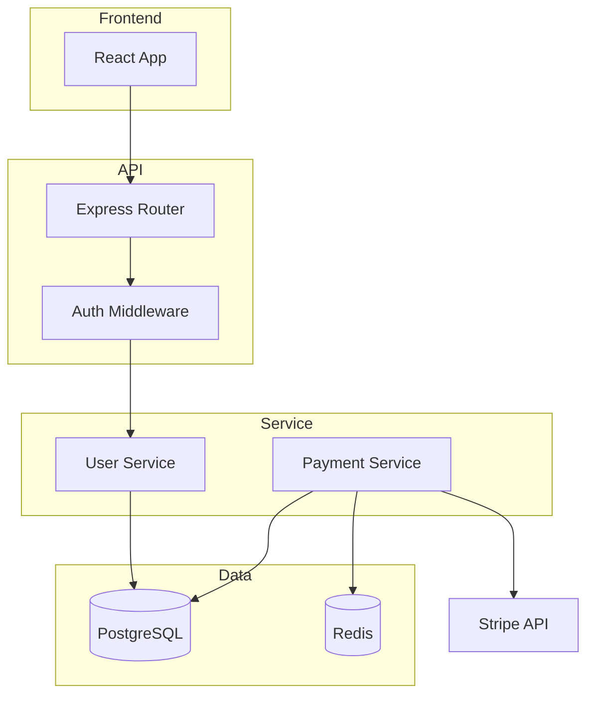

# map

Produce a structural map of the codebase: logical layers, data flows, and how the pieces connect. The goal is a mental model you can navigate by — not a file tree, but a *system diagram* with enough annotation to understand what talks to what and why.

**Prerequisite**: Run `/orient` first. Map builds on the entry points and domain model already in the snapshot.

---

## How to invoke

```
/map [path-to-repo]
```

If no path is given, use the current working directory.

---

## Step 0 — Load snapshot

Load `.archeology/snapshot.json`. If it doesn't exist, run `/orient` first.

If `map` is already in `meta.skills_run`, report existing findings and ask if the user wants to re-run.

**Write snapshot after every major step.**

---

## Step 1 — Identify logical layers

Based on the directory structure and entry points from `/orient`, identify the logical layers. These are not directories — they're *responsibilities*.

Common layer patterns for the TypeScript/Python stack:

| Layer | What it is |
|-------|-----------|
| `presentation` | UI components, templates, HTML — what users see |
| `api` | HTTP handlers, route controllers — the boundary |
| `service` | Business logic, orchestration — the brain |
| `data` | DB access, ORM models, repositories — the persistence |
| `infra` | Config, auth, queue clients, external service clients |
| `shared` | Types, utilities, constants used across layers |
| `scripts` | One-off tooling, migrations, seed scripts |

Do not force-fit. Some codebases collapse `api` and `service`. Some have no `presentation`. Map what exists.

For each layer: list the 3–5 most important files/directories that belong to it and write a one-line responsibility statement.

Record in `snapshot.structure.layers`. Write snapshot.

---

## Step 2 — Trace a request end-to-end

Pick the most important user-facing action in this codebase (infer it from `snapshot.structure.public_surface` written by `/orient`). Trace it from entry point to response:

1. Where does the request enter? (route/handler)
2. What service or business logic does it call?
3. What data layer access does it perform?
4. What does it return?
5. Does it call any external services?

Read only what you need to trace this path — typically 3–6 files. The goal is to validate the layer model you built in Step 1, not to understand every detail.

Summarize the trace as a numbered sequence in the output. If the layer model doesn't match reality (e.g., DB calls directly in route handlers), note that as a structural finding.

---

## Step 3 — Identify cross-cutting concerns

These are things that touch every layer — auth, logging, error handling, validation. They're often the most important things to understand and the most commonly botched.

Look for:
- Middleware chain (Express/Fastify middleware, FastAPI dependencies, Django middleware)
- Auth: where is authentication checked? Is it centralized or scattered?
- Logging: structured? consistent? or `console.log` throughout?
- Error handling: is there a centralized error boundary or is each handler on its own?
- Validation: where does input validation happen and what library?

Record key cross-cutting concerns in a `cross_cutting` array under `snapshot.structure`. Write snapshot.

---

## Step 4 — Draw the map (Mermaid diagram)

Produce a Mermaid diagram that shows:
- The major layers as subgraphs
- Key components within each layer
- Data flow arrows between them
- External dependencies as terminal nodes

Keep it readable: 8–15 nodes maximum. If the system is more complex, show the most important path only.

Example structure:


Save the diagram to `.archeology/map.mmd`. Write snapshot.

---

## Step 5 — Output

Print the map report:

```
## System Map

### Logical layers
[table: layer name | key paths | responsibility]

### Request trace: [action you traced]
1. [step]
2. [step]
...

### Cross-cutting concerns
[bullet list: concern → how it's handled → notable gaps]

### Architecture diagram
[mermaid diagram]

### Structural observations
[2-3 bullets on anything interesting or concerning about the architecture]
```

---

## Step 6 — Append to the aggregated report

Besides printing to the console, write the **same** content into the shared `.archeology/report.md` so the user can read every skill's output in one place.

- If `.archeology/report.md` does not exist yet (e.g. `/orient` wrote console-only), create it with this header first:
  ```markdown
  # Code Archeology Report — <repo name>

  _Generated by [code-archeology](https://github.com/mu-asad/code-archeology) · last updated <UTC timestamp>_
  ```
- Insert or replace your marker-delimited section. Keep section order `orient`, `map`, `quality`, `story`:
  ```markdown
  <!-- section:map -->
  ## System Map
  <the same content you printed to the console>
  <!-- /section:map -->
  ```
- **Embed the Mermaid diagram inline** in the section as a fenced ` ```mermaid ` block (so the report renders standalone), in addition to saving the standalone `.archeology/map.mmd`.
- Update the `last updated` timestamp in the header.

---

## Context budget rules

- **Do not read files you don't need for the trace.** Steps 1 and 3 should be done primarily from the directory structure and shallow reads.
- **The trace in Step 2 is 3–6 files max.** You're validating a model, not doing a code review.
- **If the codebase has multiple distinct services**, map one completely rather than all of them shallowly. Note the others exist.
- Write snapshot after Steps 1, 3, and 4.
