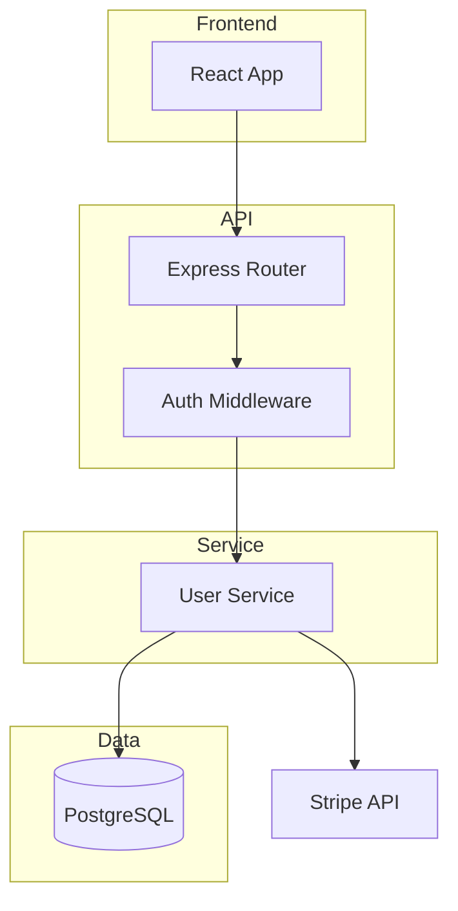

# Prompt: Map

> **Agent-agnostic version.** Works with any agent that has terminal access and can read/write files — Claude Code, GitHub Copilot agent, Codex, Cursor, etc.
>
> **How to use:**
> - *Claude Code:* use `.claude/skills/map/SKILL.md` — invoked automatically via `/map`
> - *Copilot agent / Cursor:* paste this prompt or reference it with `@workspace prompts/map.md`, then say "run the map analysis on [path]"
> - *Any other agent:* paste the prompt content directly and specify the target repo path
>
> **Requirements:** agent must be able to run terminal/bash commands and read/write files.
> **Prerequisite:** run the `orient` prompt first.

---

Produce a structural map of the codebase: logical layers, data flows, and how the pieces connect. Goal is a mental model you can navigate by — not a file tree, but a *system diagram* with enough annotation to understand what talks to what and why.

**Target repo:** [specify path, or assume current working directory]

> **Resolve the target root first.** If a path is given — or you launched the agent from a different directory — `cd` into the target repo before running any steps, so every command operates on that repo. Every step below assumes commands run **inside the target repo**.

---

> **Start this skill in a fresh conversation.** Load the snapshot, do the work, end the session. The snapshot has everything prior skills found — there is no need to carry their context forward. Chaining skills in one conversation bloats context; on large repos it will exhaust it.

## Step 0 — Load snapshot

Load `.archeology/snapshot.json`. If it doesn't exist, run the `orient` prompt first.

When citing repo-wide aggregate facts (commit counts, date span, tracked files, entry point counts), use `snapshot.meta.stats` from `orient`. Before citing a value, confirm the specific needed field is present and non-null. Do not recompute or publish alternate counts. If `meta.stats` is missing, or any needed field is absent/null, treat stats as unavailable and recommend re-running `orient` rather than guessing.

**Write snapshot after every major step.**

---

## Step 1 — Identify logical layers

Based on directory structure and entry points from `orient`, identify logical layers. These are *responsibilities*, not directories.

Common patterns for the TypeScript/Python stack:

| Layer | What it is |
|-------|-----------|
| `presentation` | UI components, templates, HTML |
| `api` | HTTP handlers, route controllers — the boundary |
| `service` | Business logic, orchestration — the brain |
| `data` | DB access, ORM models, repositories |
| `infra` | Config, auth, queue clients, external service clients |
| `shared` | Types, utilities, constants used across layers |
| `scripts` | One-off tooling, migrations, seed scripts |

Do not force-fit. Map what exists. Some codebases collapse layers; some have none of the above.

For each layer: list 3–5 most important files/directories and write a one-line responsibility statement.

Record in `snapshot.structure.layers`. Write snapshot.

---

## Step 2 — Trace a request end-to-end

Pick the most important user-facing action (infer from `snapshot.structure.public_surface` written by the orient prompt). Trace it:

1. Where does the request enter? (route/handler)
2. What service or business logic does it call?
3. What data layer access does it perform?
4. What does it return?
5. Does it call any external services?

Read only what's needed — typically 3–6 files. Goal is to validate the layer model from Step 1, not understand every detail.

Summarize as a numbered sequence. If the layer model doesn't match reality (e.g., DB calls directly in route handlers), note that as a structural finding.

---

## Step 3 — Cross-cutting concerns

Things that touch every layer — auth, logging, error handling, validation:

- **Middleware chain:** Express/Fastify middleware, FastAPI dependencies, Django middleware
- **Auth:** where is authentication checked? Centralized or scattered?
- **Logging:** structured? consistent? or `console.log` throughout?
- **Error handling:** centralized error boundary or each handler on its own?
- **Validation:** where does input validation happen and what library?

Record in `snapshot.structure.cross_cutting`. Write snapshot.

---

## Step 4 — Draw the map (Mermaid diagram)

Produce a Mermaid diagram showing:
- Major layers as subgraphs
- Key components within each layer
- Data flow arrows between them
- External dependencies as terminal nodes

Keep it readable: 8–15 nodes maximum. Show the most important path if the system is more complex.



Save the diagram to `.archeology/map.mmd`. Write snapshot.

---

## Step 5 — Output

```
## System Map

### Logical layers
[table: layer | key paths | responsibility]

### Request trace: [action traced]
1. [step]
2. [step]
...

### Cross-cutting concerns
[bullet: concern → how handled → notable gaps]

### Architecture diagram
[mermaid diagram]

### Structural observations
[2-3 bullets on anything interesting or concerning]
```

---

## Step 6 — Append to the aggregated report

Besides printing to the console, write the **same** content into the shared `.archeology/report.md` so the user can read every skill's output in one place.

- If `.archeology/report.md` does not exist yet, create it with this header first:
  ```markdown
  # Code Archeology Report — <repo name>

  _Generated by [code-archeology](https://github.com/mu-asad/code-archeology) · last updated <UTC timestamp>_
  ```
- Insert or replace your marker-delimited section. Keep section order `orient`, `map`, `api-trace`, `quality`, `the-finder-outer`, `story`:
  ```markdown
  <!-- section:map -->
  <the same content you printed to the console, verbatim — it already begins with `## System Map`, so do not add another heading>
  <!-- /section:map -->
  ```
- **Embed the Mermaid diagram inline** in the section as a fenced ` ```mermaid ` block (so the report renders standalone), in addition to saving the standalone `.archeology/map.mmd`.
- Update the `last updated` timestamp in the header.

Then write the snapshot one final time with `map` added to `meta.skills_run`.

---

## Context budget rules

- **Do not read files beyond what's needed for the trace.** Steps 1 and 3 come from directory structure and shallow reads.
- **The trace is 3–6 files max.** Validating a model, not doing a code review.
- **Multiple services?** Map one completely rather than all of them shallowly. Note the others.
- Write snapshot after Steps 1, 3, and 4.
